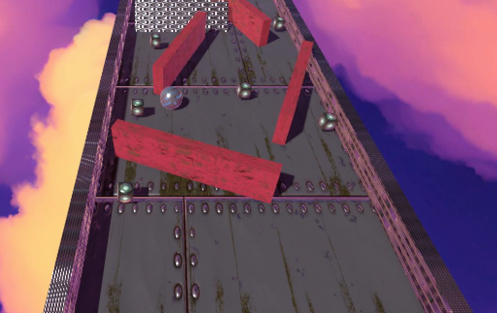

# WallRider

## Description
WallRider is an exciting Unity game where players control a ball through various levels, navigating pathways, platforms, and obstacles while collecting cubes to progress. Be cautious of red walls as colliding with them decreases your life. With engaging gameplay and immersive environments, WallRider offers a thrilling experience for players of all skill levels.

## Gameplay
- **Starting the Game:** Select a level from the main menu.
- **Objective:** Collect all the cubes scattered throughout the level environment.
- **Controls:** Use arrow keys (Up, Down, Left, Right) or WSAD keys (W, S, A, D) to control the movement of the ball.
- **Life and Timer:** Watch out for your life represented by a numerical value. The game also features a timer, and if it reaches zero or your life falls below zero due to collisions with red walls, the game ends.
- **Collecting Cubes:** Roll the ball over the cubes to collect them. Each cube collected contributes to your progress.

## Features
- Engaging gameplay with intuitive controls.
- Diverse levels with unique environments, pathways, and obstacles.
- Realistic sound effects to enhance the gaming experience.
- Stunning skybox and materials for immersive visuals.

## Credits
**Sounds:**
- *Item Pickup* by TreasureSounds ([License](https://freesound.org/s/332629/)) 
- *Jungle Level* by SintelV ([License](https://freesound.org/s/669543/))
- *Damage* by qubodup ([License](https://freesound.org/s/211634/))

**Material Assets:**

**Skybox Credit:** Midgard Skybox 2 ([Asset Store](https://assetstore.unity.com/packages/2d/textures-materials/sky/midgard-skybox-2))
**Materials Credit:** Yughues Free Metal Materials ([Asset Store](https://assetstore.unity.com/packages/2d/textures-materials/metals/yughues-free-metal-materials-12950))

## Play Now!
Experience the thrill of WallRider on [itch.io](https://tomasalessi.itch.io/wallrider). Get ready to roll and collect cubes in this exciting Unity game!

